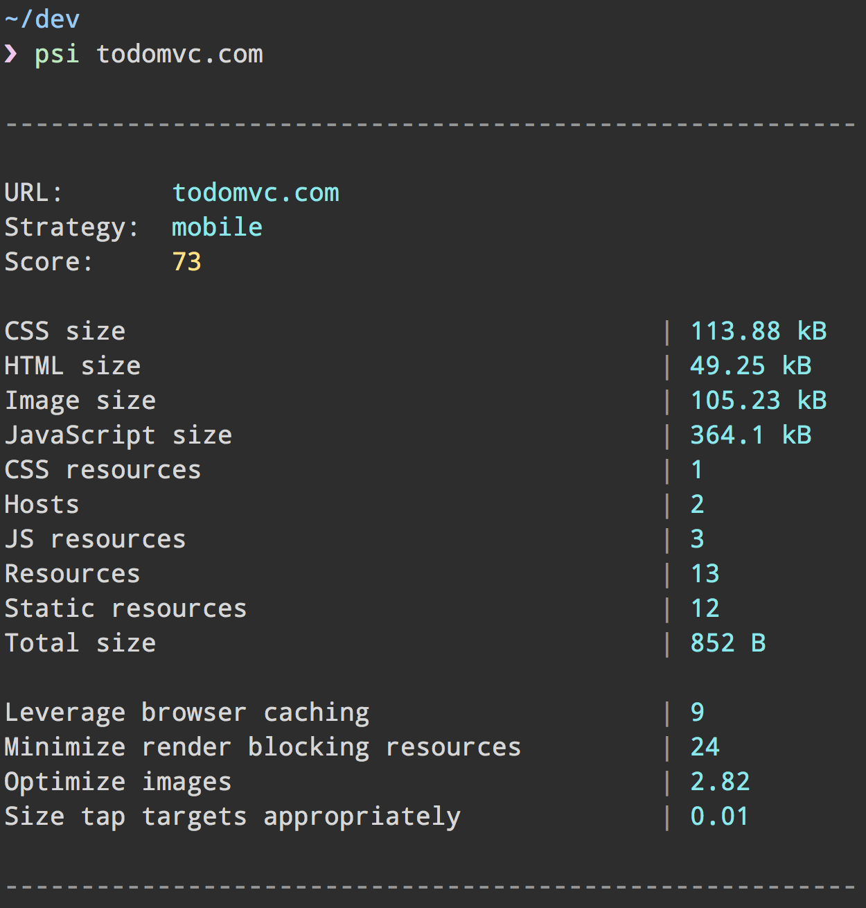

# psi [](https://travis-ci.org/addyosmani/psi)

> PageSpeed Insights with reporting



Run mobile and desktop performance tests for your deployed site using [Google PageSpeed Insights](https://developers.google.com/speed/docs/insights/v2/getting-started) V2 with tidy reporting for your build process.


## Install

```
$ npm install psi
```


## Usage

```js
const psi = require('psi');

// Get the PageSpeed Insights report
psi('theverge.com').then(data => {
  console.log(data.ruleGroups.SPEED.score);
  console.log(data.pageStats);
});

// Output a formatted report to the terminal
psi.output('theverge.com').then(() => {
  console.log('done');
});

// Supply options to PSI and get back speed and usability scores
psi('theverge.com', {nokey: 'true', strategy: 'mobile'}).then(data => {
  console.log('Speed score:', data.ruleGroups.SPEED.score);
  console.log('Usability score:', data.ruleGroups.USABILITY.score);
});
```

As of PSI 2.x, we expose both the PageSpeed Insights speed and usability scores. The latter is based on [usability rules](https://developers.google.com/speed/docs/insights/rules) that score a page based on factors like the presence of a sensible mobile [viewport](https://developers.google.com/speed/docs/insights/ConfigureViewport).


## API

### psi(url, [options])

Returns a `Promise` for the response data from Google PageSpeed Insights.

#### url

Type: `string`

URL of the page for which the PageSpeed Insights API should generate results.

#### options

Type: `Object`

##### key

Type: `string`<br>
Default: Free tier

When using this module for a production-level build process, registering for an API key from the [Google Developer Console](https://developers.google.com/speed/docs/insights/v1/getting_started#auth) is recommended.

##### strategy

Type: `string`<br>
Default: `mobile`<br>
Values: `mobile` `desktop`

Strategy to use when analyzing the page.

##### locale

Type: `string`<br>
Default: `en_US`

Locale results should be generated in.

##### threshold

Type: `number`<br>
Default: `70`

Threshold score to pass the PageSpeed test. Useful for setting a performance budget.

### psi.output(url, [options])

Output the formatted report to the terminal.

Returns a promise for the response data from Google PageSpeed Insights.

`url` and `options` is the same as `psi()`.


## CLI

```
$ npm install --global psi
```

```
$ psi --help

  Usage
    $ psi <url>

  Options
    --key        Google API Key. By default the free tier is used
    --strategy   Strategy to use when analyzing the page: mobile|desktop
    --format     Output format: cli|json|tap
    --locale     Locale results should be generated in
    --threshold  Threshold score to pass the PageSpeed test
    --optimized  Get the URL of optimized resources
    --download   Download optimized resources

  Example
    $ psi todomvc.com --strategy=mobile
```


## Getting PSI into your build process

A sample [Gulp](https://github.com/addyosmani/psi-gulp-sample) project using PSI is available.

If you use Grunt, [`grunt-pagespeed`](https://github.com/jrcryer/grunt-pagespeed) is a task by James Cryer that uses PSI under the hood.

For testing local project, we recommend using [ngrok](http://www.jamescryer.com/2014/06/12/grunt-pagespeed-and-ngrok-locally-testing/).


## License

Apache-2.0 - Copyright 2015 Google Inc
